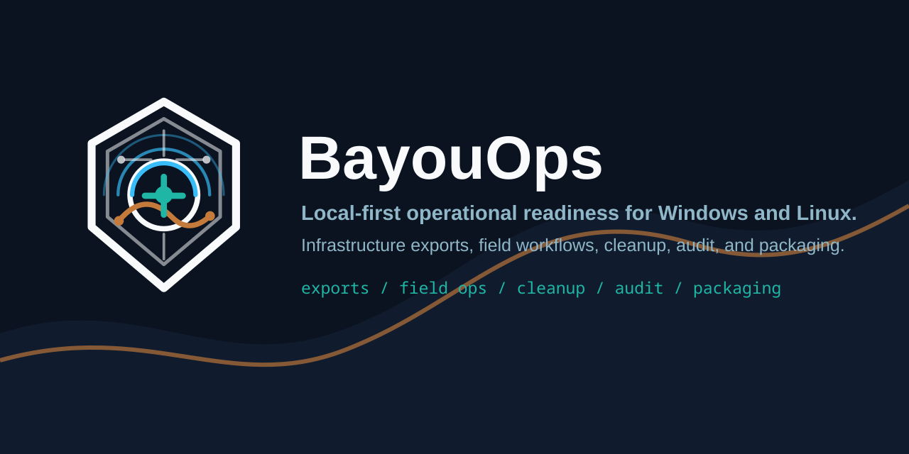

<p align="center">
  
</p>

<p align="center">
  
</p>

# BayouFinds Windows Cleanup Tool




> Fast. Safe. No registry hacks. Just clean performance.

## 💾 Get the Full Ready-to-Run Version

Want the simple, packaged version with instructions?

👉 **⬇️ Download the Full Version (Ready-to-Run)**  
https://bayoufinds.com/b/y3OJr

---

A simple, safe Windows cleanup script that removes junk files and improves performance using only built-in Windows tools.

---

## 🔧 What It Does

- Cleans temp files (user + system)
- Clears Windows Update cache
- Flushes DNS cache
- Empties recycle bin
- Runs DISM system cleanup

---

## 🛡️ Safe by Design

- No registry edits  
- No service disabling  
- Uses trusted Windows commands only  

---

## 🚀 How to Use

Run PowerShell as Administrator:

```powershell
Set-ExecutionPolicy -Scope Process Bypass -Force
.\BayouFinds_Windows_Cleanup.ps1
